# openLUXbox
## Bauanleitung V1
Diese Anleitung beschreibt den Bau der openLUXbox v1. Die benötigten Teile können bestellt werden. Case + Cover müssen 3d-gedruckt werden.
### Case + Cover
Beide Teile sind mit PLA gedruckt. 
Das Case wird in einem Stück gedruckt. Dabei sind Stützen zu aktivieren. 
Das Cover besteht ebenfalls aus PLA. Die ersten Schichten sind einfach weißes PLA, das trennende Raster schwarzes PLA. Ohne Multifarbdrucker ist beim Slicen mit dem Beginn des Rasters ein Farbwechsel einzustellen.
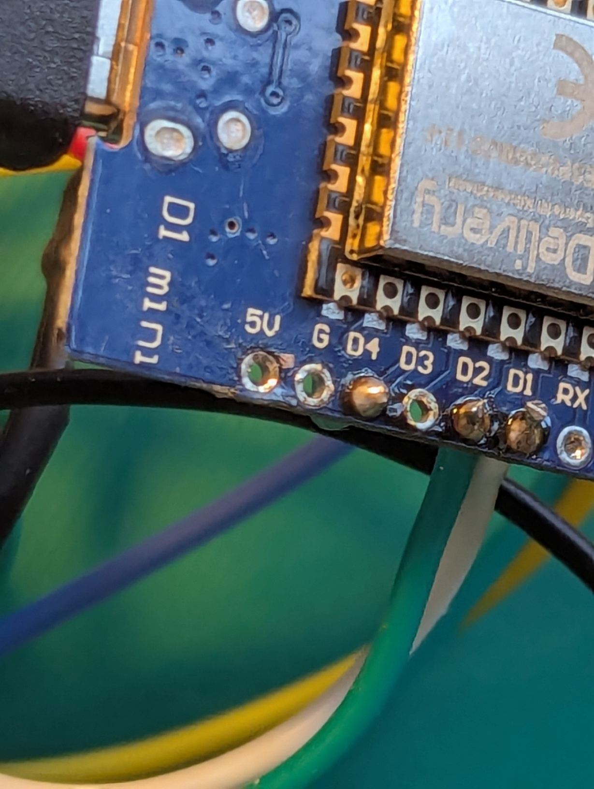
### Verkabelung
Der ESP8266 wird später in diese Halterung geschoben.
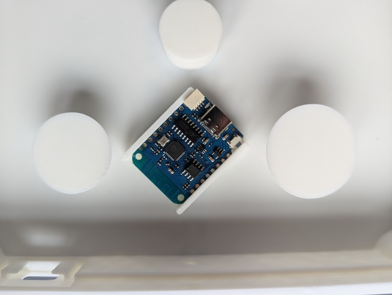
Die Stromversorgung erfolgt über eine USB-C-Buchse, an die ein Stecker angelötet wird. Dieser versorgt den ESP mit +5V/GND und zwei Datenleitungen, um Spiele zu flashen.
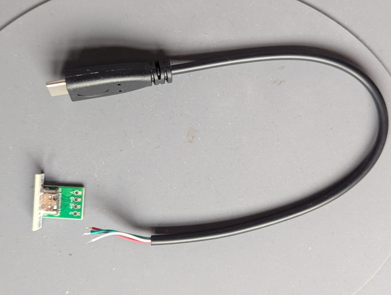
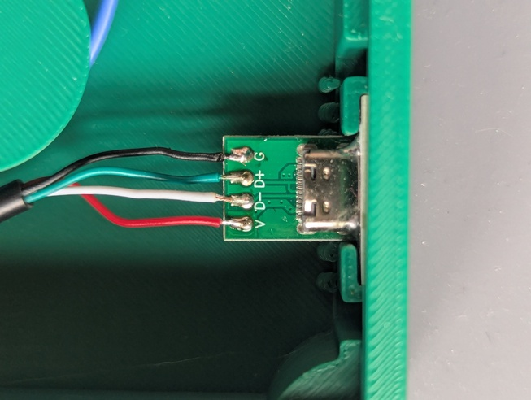
Die Buttons haben einen Distanzring und eine Gewindemutter. Zwei Kabel (ca. 20cm) werden angelötet (oder sind es bereits).
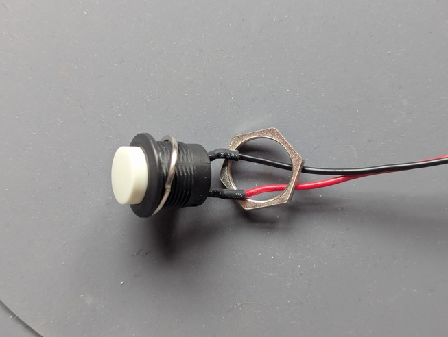
Die Mutter wird von unten in den Halterungen der Buttons gesetzt.
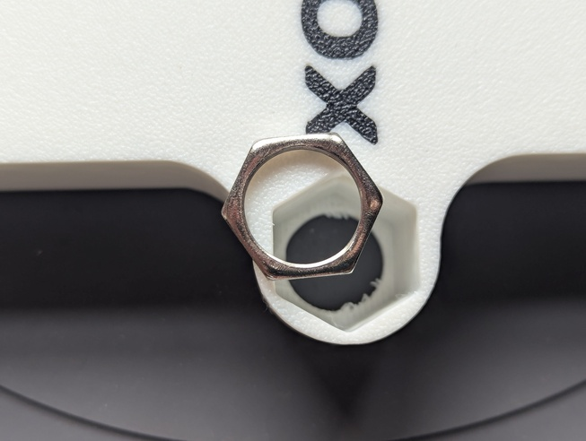
Der Buttton wird dann von oben mit Distanzring und Kabeln eingeführt und in die Mutter eingedreht. Sitzt der Button fest, werden die beiden Kabel durch die Öffnung nach innen geeführt.
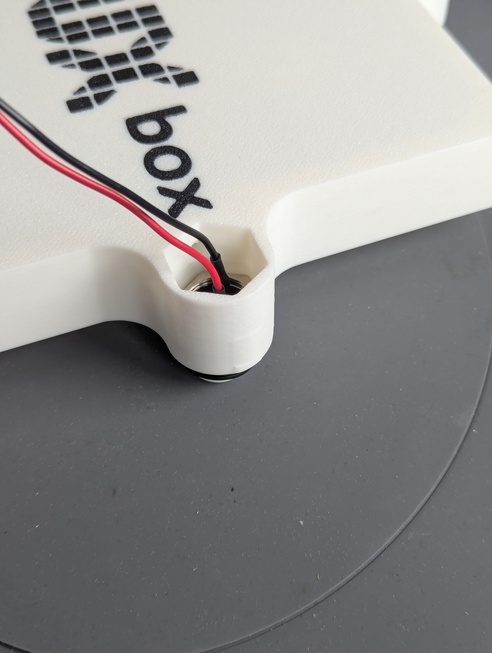
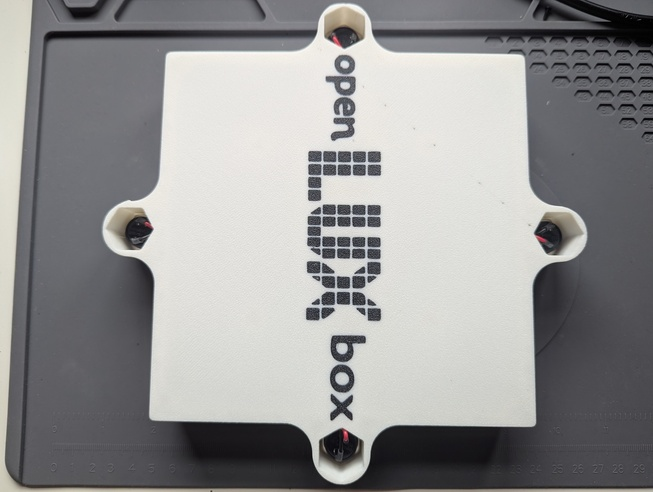

Die roten Kabel der Buttons entweder direkt an den ESP gelötet werden. Alternativ (wie im Bild) lötet man kurze Verbindungskabel in der jeweiligen Buttonfarbe an den ESP. Diese werden dann mit den roten Kabeln des jeweiligen Buttons verbunden.
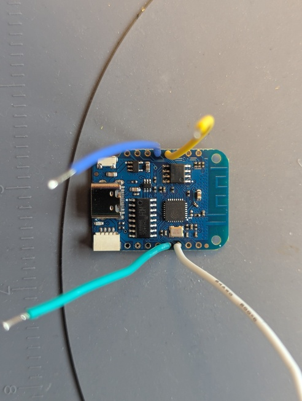
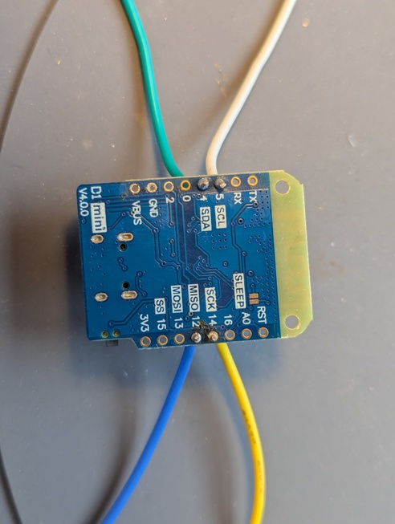
Zwischen ESP und die Datenverbindung des LED (grünes Kabel) wird der Widerstand gelötet.
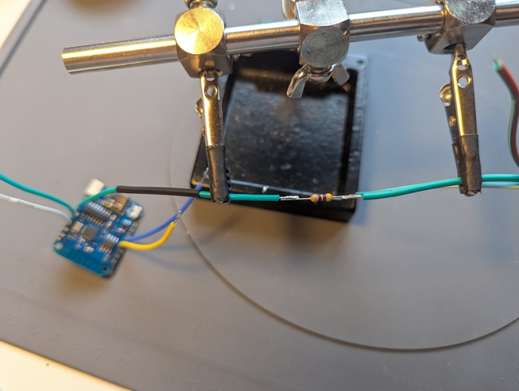
Hier die vollständige Beschaltung des ESP. PIN 4 ist dabei der grüne Button. PIN 2 die Datenverbindung zum LED.
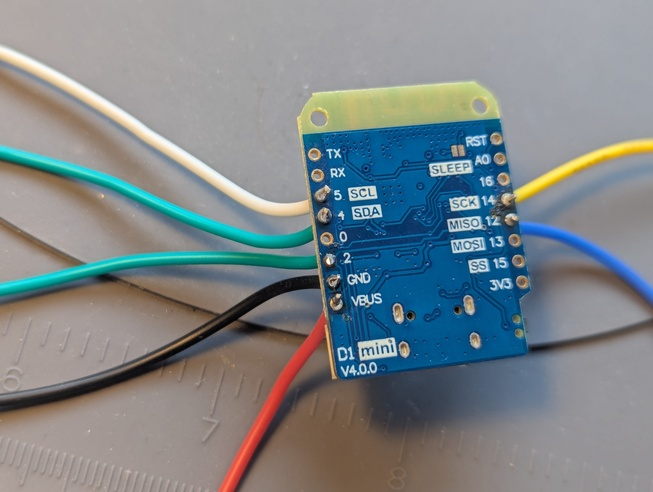
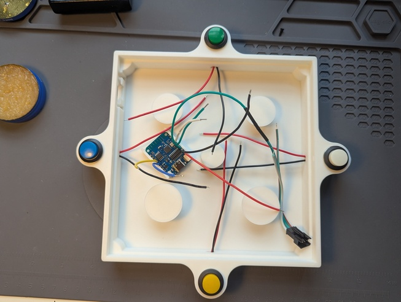

